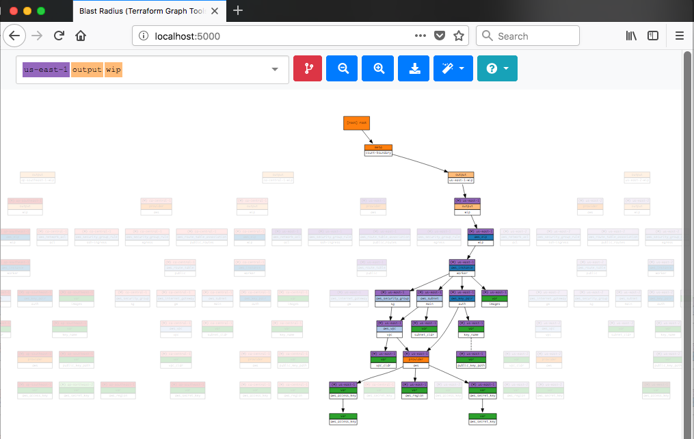

# Blast Radius

## Usage
`vagrant up --provision-with blastradius`

```
Bringing machine 'hashiqube0.service.consul' up with 'virtualbox' provider...
==> hashiqube0.service.consul: Checking if box 'ubuntu/bionic64' version '20191218.0.0' is up to date...
==> hashiqube0.service.consul: [vagrant-hostsupdater] Checking for host entries
==> hashiqube0.service.consul: [vagrant-hostsupdater]   found entry for: 10.9.99.10 hashiqube0.service.consul
==> hashiqube0.service.consul: Running provisioner: blastradius (shell)...
    hashiqube0.service.consul: Running: /var/folders/7j/gsrjvmds05n53ddg28krf4_80001p9/T/vagrant-shell20200331-16292-1bqd8dd.sh
    hashiqube0.service.consul: ++++ docker build -t blastradius .
    hashiqube0.service.consul: Sending build context to Docker daemon  2.215MB
    hashiqube0.service.consul: Step 1/14 : ARG TF_VERSION=0.12.20
    hashiqube0.service.consul: Step 2/14 : ARG PYTHON_VERSION=3.7
    hashiqube0.service.consul: Step 3/14 : FROM hashicorp/terraform:$TF_VERSION AS terraform
    hashiqube0.service.consul: 0.12.20: Pulling from hashicorp/terraform
    hashiqube0.service.consul: c9b1b535fdd9: Pulling fs layer
    hashiqube0.service.consul: de7e97a272b4: Pulling fs layer
    hashiqube0.service.consul: 96f252e89940: Pulling fs layer
    hashiqube0.service.consul: c9b1b535fdd9: Waiting
    hashiqube0.service.consul: 96f252e89940: Waiting
    hashiqube0.service.consul: de7e97a272b4: Waiting
    hashiqube0.service.consul: c9b1b535fdd9: Verifying Checksum
    hashiqube0.service.consul: c9b1b535fdd9: Download complete
    hashiqube0.service.consul: c9b1b535fdd9: Pull complete
    hashiqube0.service.consul: de7e97a272b4: Verifying Checksum
    hashiqube0.service.consul: de7e97a272b4: Download complete
    hashiqube0.service.consul: de7e97a272b4: Pull complete
    hashiqube0.service.consul: 96f252e89940: Verifying Checksum
    hashiqube0.service.consul: 96f252e89940: Download complete
    hashiqube0.service.consul: 96f252e89940: Pull complete
    hashiqube0.service.consul: Digest: sha256:5e19b9bab0b6d079cae8822be22cd7010f65177356600154b77fc4fc81bdde31
    hashiqube0.service.consul: Status: Downloaded newer image for hashicorp/terraform:0.12.20
    hashiqube0.service.consul:  ---> e6dd0042ca56
    hashiqube0.service.consul: Step 4/14 : FROM python:$PYTHON_VERSION-alpine
    hashiqube0.service.consul: 3.7-alpine: Pulling from library/python
    hashiqube0.service.consul: aad63a933944: Pulling fs layer
    hashiqube0.service.consul: f229563217f5: Pulling fs layer
    hashiqube0.service.consul: 71ded8122394: Pulling fs layer
    hashiqube0.service.consul: 807d0888ee2e: Pulling fs layer
    hashiqube0.service.consul: 95206a02ba21: Pulling fs layer
    hashiqube0.service.consul: f229563217f5: Waiting
    hashiqube0.service.consul: 71ded8122394: Waiting
    hashiqube0.service.consul: 807d0888ee2e: Waiting
    hashiqube0.service.consul: 95206a02ba21: Waiting
    hashiqube0.service.consul: aad63a933944: Verifying Checksum
    hashiqube0.service.consul: aad63a933944: Download complete
    hashiqube0.service.consul: aad63a933944: Pull complete
    hashiqube0.service.consul: f229563217f5: Download complete
    hashiqube0.service.consul: f229563217f5: Pull complete
    hashiqube0.service.consul: 71ded8122394: Verifying Checksum
    hashiqube0.service.consul: 71ded8122394: Download complete
    hashiqube0.service.consul: 71ded8122394: Pull complete
    hashiqube0.service.consul: 807d0888ee2e: Verifying Checksum
    hashiqube0.service.consul: 807d0888ee2e: Download complete
    hashiqube0.service.consul: 807d0888ee2e: Pull complete
    hashiqube0.service.consul: 95206a02ba21: Verifying Checksum
    hashiqube0.service.consul: 95206a02ba21: Download complete
    hashiqube0.service.consul: 95206a02ba21: Pull complete
    hashiqube0.service.consul: Digest: sha256:4a704ebee45695fa91125301e43eee08a85fc984d05cc75650cc66fad7826c56
    hashiqube0.service.consul: Status: Downloaded newer image for python:3.7-alpine
    hashiqube0.service.consul:  ---> 7fbc871584eb
    hashiqube0.service.consul: Step 5/14 : RUN pip install -U pip ply  && apk add --update --no-cache graphviz ttf-freefont
    hashiqube0.service.consul:  ---> Running in 494ef95c0f57
    hashiqube0.service.consul: Requirement already up-to-date: pip in /usr/local/lib/python3.7/site-packages (20.0.2)
    hashiqube0.service.consul: Collecting ply
    hashiqube0.service.consul:   Downloading ply-3.11-py2.py3-none-any.whl (49 kB)
    hashiqube0.service.consul: Installing collected packages: ply
    hashiqube0.service.consul: Successfully installed ply-3.11
    hashiqube0.service.consul: fetch http://dl-cdn.alpinelinux.org/alpine/v3.11/main/x86_64/APKINDEX.tar.gz
    hashiqube0.service.consul: fetch http://dl-cdn.alpinelinux.org/alpine/v3.11/community/x86_64/APKINDEX.tar.gz
    hashiqube0.service.consul: (1/35) Installing libxau (1.0.9-r0)
    hashiqube0.service.consul: (2/35) Installing libbsd (0.10.0-r0)
    hashiqube0.service.consul: (3/35) Installing libxdmcp (1.1.3-r0)
    hashiqube0.service.consul: (4/35) Installing libxcb (1.13.1-r0)
    hashiqube0.service.consul: (5/35) Installing libx11 (1.6.9-r0)
    hashiqube0.service.consul: (6/35) Installing libxext (1.3.4-r0)
    hashiqube0.service.consul: (7/35) Installing libice (1.0.10-r0)
    hashiqube0.service.consul: (8/35) Installing libsm (1.2.3-r0)
    hashiqube0.service.consul: (9/35) Installing libxt (1.2.0-r0)
    hashiqube0.service.consul: (10/35) Installing libxmu (1.1.3-r0)
    hashiqube0.service.consul: (11/35) Installing libxpm (3.5.13-r0)
    hashiqube0.service.consul: (12/35) Installing libxaw (1.0.13-r3)
    hashiqube0.service.consul: (13/35) Installing libxrender (0.9.10-r3)
    hashiqube0.service.consul: (14/35) Installing libpng (1.6.37-r1)
    hashiqube0.service.consul: (15/35) Installing freetype (2.10.1-r0)
    hashiqube0.service.consul: (16/35) Installing fontconfig (2.13.1-r2)
    hashiqube0.service.consul: (17/35) Installing pixman (0.38.4-r0)
    hashiqube0.service.consul: (18/35) Installing cairo (1.16.0-r2)
    hashiqube0.service.consul: (19/35) Installing libgcc (9.2.0-r4)
    hashiqube0.service.consul: (20/35) Installing libblkid (2.34-r1)
    hashiqube0.service.consul: (21/35) Installing libmount (2.34-r1)
    hashiqube0.service.consul: (22/35) Installing pcre (8.43-r0)
    hashiqube0.service.consul: (23/35) Installing glib (2.62.6-r0)
    hashiqube0.service.consul: (24/35) Installing libltdl (2.4.6-r7)
    hashiqube0.service.consul: (25/35) Installing libxft (2.3.3-r0)
    hashiqube0.service.consul: (26/35) Installing fribidi (1.0.8-r0)
    hashiqube0.service.consul: (27/35) Installing graphite2 (1.3.13-r1)
    hashiqube0.service.consul: (28/35) Installing harfbuzz (2.6.4-r0)
    hashiqube0.service.consul: (29/35) Installing pango (1.44.7-r0)
    hashiqube0.service.consul: (30/35) Installing libstdc++ (9.2.0-r4)
    hashiqube0.service.consul: (31/35) Installing graphviz (2.42.3-r0)
    hashiqube0.service.consul: (32/35) Installing encodings (1.0.5-r0)
    hashiqube0.service.consul: (33/35) Installing libfontenc (1.1.4-r0)
    hashiqube0.service.consul: (34/35) Installing mkfontscale (1.2.1-r1)
    hashiqube0.service.consul: (35/35) Installing ttf-freefont (20120503-r1)
    hashiqube0.service.consul: Executing busybox-1.31.1-r9.trigger
    hashiqube0.service.consul: Executing fontconfig-2.13.1-r2.trigger
    hashiqube0.service.consul: Executing graphviz-2.42.3-r0.trigger
    hashiqube0.service.consul: Executing mkfontscale-1.2.1-r1.trigger
    hashiqube0.service.consul: OK: 46 MiB in 69 packages
    hashiqube0.service.consul: Removing intermediate container 494ef95c0f57
    hashiqube0.service.consul:  ---> fae8b72a0a2e
    hashiqube0.service.consul: Step 6/14 : COPY --from=terraform /bin/terraform /bin/terraform
    hashiqube0.service.consul:  ---> bca5257204c7
    hashiqube0.service.consul: Step 7/14 : COPY ./docker-entrypoint.sh /bin/docker-entrypoint.sh
    hashiqube0.service.consul:  ---> a175fc8c9879
    hashiqube0.service.consul: Step 8/14 : RUN chmod +x /bin/docker-entrypoint.sh
    hashiqube0.service.consul:  ---> Running in 97aef786bbc7
    hashiqube0.service.consul: Removing intermediate container 97aef786bbc7
    hashiqube0.service.consul:  ---> 32120570b2dc
    hashiqube0.service.consul: Step 9/14 : WORKDIR /src
    hashiqube0.service.consul:  ---> Running in 53ea1c6fc4e7
    hashiqube0.service.consul: Removing intermediate container 53ea1c6fc4e7
    hashiqube0.service.consul:  ---> 40d6364b44cf
    hashiqube0.service.consul: Step 10/14 : COPY . .
    hashiqube0.service.consul:  ---> 12567013ad88
    hashiqube0.service.consul: Step 11/14 : RUN pip install -e .
    hashiqube0.service.consul:  ---> Running in 1ffdf98b1069
    hashiqube0.service.consul: Obtaining file:///src
    hashiqube0.service.consul: Collecting setuptools==41.0.1
    hashiqube0.service.consul:   Downloading setuptools-41.0.1-py2.py3-none-any.whl (575 kB)
    hashiqube0.service.consul: Collecting requests==2.22.0
    hashiqube0.service.consul:   Downloading requests-2.22.0-py2.py3-none-any.whl (57 kB)
    hashiqube0.service.consul: Collecting Jinja2==2.10.1
    hashiqube0.service.consul:   Downloading Jinja2-2.10.1-py2.py3-none-any.whl (124 kB)
    hashiqube0.service.consul: Collecting Flask==1.0.3
    hashiqube0.service.consul:   Downloading Flask-1.0.3-py2.py3-none-any.whl (92 kB)
    hashiqube0.service.consul: Collecting beautifulsoup4==4.7.1
    hashiqube0.service.consul:   Downloading beautifulsoup4-4.7.1-py3-none-any.whl (94 kB)
    hashiqube0.service.consul: Requirement already satisfied: ply>=3.11 in /usr/local/lib/python3.7/site-packages (from blastradius==0.1.25) (3.11)
    hashiqube0.service.consul: Collecting pyhcl==0.3.12
    hashiqube0.service.consul:   Downloading pyhcl-0.3.12.tar.gz (21 kB)
    hashiqube0.service.consul: Collecting chardet<3.1.0,>=3.0.2
    hashiqube0.service.consul:   Downloading chardet-3.0.4-py2.py3-none-any.whl (133 kB)
    hashiqube0.service.consul: Collecting certifi>=2017.4.17
    hashiqube0.service.consul:   Downloading certifi-2019.11.28-py2.py3-none-any.whl (156 kB)
    hashiqube0.service.consul: Collecting idna<2.9,>=2.5
    hashiqube0.service.consul:   Downloading idna-2.8-py2.py3-none-any.whl (58 kB)
    hashiqube0.service.consul: Collecting urllib3!=1.25.0,!=1.25.1,<1.26,>=1.21.1
    hashiqube0.service.consul:   Downloading urllib3-1.25.8-py2.py3-none-any.whl (125 kB)
    hashiqube0.service.consul: Collecting MarkupSafe>=0.23
    hashiqube0.service.consul:   Downloading MarkupSafe-1.1.1.tar.gz (19 kB)
    hashiqube0.service.consul: Collecting itsdangerous>=0.24
    hashiqube0.service.consul:   Downloading itsdangerous-1.1.0-py2.py3-none-any.whl (16 kB)
    hashiqube0.service.consul: Collecting Werkzeug>=0.14
    hashiqube0.service.consul:   Downloading Werkzeug-1.0.0-py2.py3-none-any.whl (298 kB)
    hashiqube0.service.consul: Collecting click>=5.1
    hashiqube0.service.consul:   Downloading click-7.1.1-py2.py3-none-any.whl (82 kB)
    hashiqube0.service.consul: Collecting soupsieve>=1.2
    hashiqube0.service.consul:   Downloading soupsieve-2.0-py2.py3-none-any.whl (32 kB)
    hashiqube0.service.consul: Building wheels for collected packages: pyhcl, MarkupSafe
    hashiqube0.service.consul:   Building wheel for pyhcl (setup.py): started
    hashiqube0.service.consul:   Building wheel for pyhcl (setup.py): finished with status 'done'
    hashiqube0.service.consul:   Created wheel for pyhcl: filename=pyhcl-0.3.12-py3-none-any.whl size=17314 sha256=c3abbcf6afd55211851a121e05cbe31bfa1059e115f34eefb5bd52d21db2f6cd
    hashiqube0.service.consul:   Stored in directory: /root/.cache/pip/wheels/ee/13/27/d405c0d4c8bcb7e0660e401e66dbdb9b3e5a95bfe8e895d306
    hashiqube0.service.consul:   Building wheel for MarkupSafe (setup.py): started
    hashiqube0.service.consul:   Building wheel for MarkupSafe (setup.py): finished with status 'done'
    hashiqube0.service.consul:   Created wheel for MarkupSafe: filename=MarkupSafe-1.1.1-py3-none-any.whl size=12629 sha256=763b621bb5a7ce04ac784c6579ed0d8466c9fdd002d6a08684ec595eab51b3bc
    hashiqube0.service.consul:   Stored in directory: /root/.cache/pip/wheels/b9/d9/ae/63bf9056b0a22b13ade9f6b9e08187c1bb71c47ef21a8c9924
    hashiqube0.service.consul: Successfully built pyhcl MarkupSafe
    hashiqube0.service.consul: Installing collected packages: setuptools, chardet, certifi, idna, urllib3, requests, MarkupSafe, Jinja2, itsdangerous, Werkzeug, click, Flask, soupsieve, beautifulsoup4, pyhcl, blastradius
    hashiqube0.service.consul:   Attempting uninstall: setuptools
    hashiqube0.service.consul:     Found existing installation: setuptools 46.1.1
    hashiqube0.service.consul:     Uninstalling setuptools-46.1.1:
    hashiqube0.service.consul:       Successfully uninstalled setuptools-46.1.1
    hashiqube0.service.consul:   Running setup.py develop for blastradius
    hashiqube0.service.consul: Successfully installed Flask-1.0.3 Jinja2-2.10.1 MarkupSafe-1.1.1 Werkzeug-1.0.0 beautifulsoup4-4.7.1 blastradius certifi-2019.11.28 chardet-3.0.4 click-7.1.1 idna-2.8 itsdangerous-1.1.0 pyhcl-0.3.12 requests-2.22.0 setuptools-41.0.1 soupsieve-2.0 urllib3-1.25.8
    hashiqube0.service.consul: Removing intermediate container 1ffdf98b1069
    hashiqube0.service.consul:  ---> 41fce9454a32
    hashiqube0.service.consul: Step 12/14 : WORKDIR /data
    hashiqube0.service.consul:  ---> Running in a96b5d129362
    hashiqube0.service.consul: Removing intermediate container a96b5d129362
    hashiqube0.service.consul:  ---> 9bb22d32e868
    hashiqube0.service.consul: Step 13/14 : ENTRYPOINT ["/bin/docker-entrypoint.sh"]
    hashiqube0.service.consul:  ---> Running in 4b7d9955b321
    hashiqube0.service.consul: Removing intermediate container 4b7d9955b321
    hashiqube0.service.consul:  ---> 69ba8b3e25a8
    hashiqube0.service.consul: Step 14/14 : CMD ["blast-radius", "--serve"]
    hashiqube0.service.consul:  ---> Running in 11210f674933
    hashiqube0.service.consul: Removing intermediate container 11210f674933
    hashiqube0.service.consul:  ---> f55ef45b8f6e
    hashiqube0.service.consul: Successfully built f55ef45b8f6e
    hashiqube0.service.consul: Successfully tagged blastradius:latest
    hashiqube0.service.consul: ++++ docker images --filter reference=blastradius
    hashiqube0.service.consul: REPOSITORY          TAG                 IMAGE ID            CREATED                  SIZE
    hashiqube0.service.consul: blastradius         latest              f55ef45b8f6e        Less than a second ago   201MB
    hashiqube0.service.consul: a6a68b9bcab99939932adb01707e9d1b1d5539ce3db38af8847b9862954cd702
    hashiqube0.service.consul: ++++ Blast-Radius: http://localhost:5000/
```

[](https://circleci.com/gh/28mm/blast-radius/tree/master)
[](https://badge.fury.io/py/BlastRadius)

[terraform]: https://www.terraform.io/
[examples]: https://28mm.github.io/blast-radius-docs/

_Blast Radius_ is a tool for reasoning about [Terraform][] dependency graphs
with interactive visualizations.

Use _Blast Radius_ to:

* __Learn__ about *Terraform* or one of its providers through real [examples][]
* __Document__ your infrastructure
* __Reason__ about relationships between resources and evaluate changes to them
* __Interact__ with the diagram below (and many others) [in the docs][examples]



## Prerequisites

* [Graphviz](https://www.graphviz.org/)
* [Python](https://www.python.org/) 3.7 or newer

> __Note:__ For macOS you can `brew install graphviz`

## Quickstart

The fastest way to get up and running with *Blast Radius* is to install it with
`pip` to your pre-existing environment:

```sh
pip install blastradius
```

Once installed just point *Blast Radius* at any initialized *Terraform*
directory:

```sh
blast-radius --serve /path/to/terraform/directory
```

And you will shortly be rewarded with a browser link http://127.0.0.1:5000/.

## Docker

[privileges]: https://docs.docker.com/engine/reference/run/#runtime-privilege-and-linux-capabilities
[overlayfs]: https://wiki.archlinux.org/index.php/Overlay_filesystem

To launch *Blast Radius* for a local directory by manually running:

```sh
docker run --rm -it -p 5000:5000 \
  -v $(pwd):/data:ro \
  --security-opt apparmor:unconfined \
  --cap-add=SYS_ADMIN \
  28mm/blast-radius
```

A slightly more customized variant of this is also available as an example
[docker-compose.yml](./examples/docker-compose.yml) usecase for Workspaces.

### Docker configurations

*Terraform* module links are saved as _absolute_ paths in relative to the
project root (note `.terraform/modules/<uuid>`). Given these paths will vary
betwen Docker and the host, we mount the volume as read-only, assuring we don't
ever interfere with your real environment.

However, in order for *Blast Radius* to actually work with *Terraform*, it needs
to be initialized. To accomplish this, the container creates an [overlayfs][]
that exists within the container, overlaying your own, so that it can operate
independently. To do this, certain runtime privileges are required --
specifically `--cap-add=SYS_ADMIN`.

For more information on how this works and what it means for your host, check
out the [runtime privileges][privileges] documentation.

#### Docker & Subdirectories

If you organized your *Terraform* project using stacks and modules,
*Blast Radius* must be called from the project root and reference them as
subdirectories -- don't forget to prefix `--serve`!

For example, let's create a Terraform `project` with the following:

```txt
$ tree -d
`-- project/
    |-- modules/
    |   |-- foo
    |   |-- bar
    |   `-- dead
    `-- stacks/
        `-- beef/
             `-- .terraform
```

It consists of 3 modules `foo`, `bar` and `dead`, followed by one `beef` stack.
To apply *Blast Radius* to the `beef` stack, you would want to run the container
with the following:

```sh
$ cd project
$ docker run --rm -it -p 5000:5000 \
    -v $(pwd):/data:ro \
    --security-opt apparmor:unconfined \
    --cap-add=SYS_ADMIN \
    28mm/blast-radius --serve stacks/beef
```

## Embedded Figures

You may wish to embed figures produced with *Blast Radius* in other documents.
You will need the following:

1. An `svg` file and `json` document representing the graph and its layout.
2. `javascript` and `css` found in `.../blastradius/server/static`
3. A uniquely identified DOM element, where the `<svg>` should appear.

You can read more details in the [documentation](doc/embedded.md)

## Implementation Details

*Blast Radius* uses the [Graphviz][] package to layout graph diagrams,
[PyHCL](https://github.com/virtuald/pyhcl) to parse [Terraform][] configuration,
and [d3.js](https://d3js.org/) to implement interactive features and animations.

## Further Reading

The development of *Blast Radius* is documented in a series of
[blog](https://28mm.github.io) posts:

* [part 1](https://28mm.github.io/notes/d3-terraform-graphs): motivations, d3 force-directed layouts vs. vanilla graphviz.
* [part 2](https://28mm.github.io/notes/d3-terraform-graphs-2): d3-enhanced graphviz layouts, meaningful coloration, animations.
* [part 3](https://28mm.github.io/notes/terraform-graphs-3): limiting horizontal sprawl, supporting modules.
* [part 4](https://28mm.github.io/notes/d3-terraform-graphs-4): search, pan/zoom, prune-to-selection, docker.

A catalog of example *Terraform* configurations, and their dependency graphs
can be found [here](https://28mm.github.io/blast-radius-docs/).

* [AWS two-tier architecture](https://28mm.github.io/blast-radius-docs/examples/terraform-provider-aws/two-tier/)
* [AWS networking (featuring modules)](https://28mm.github.io/blast-radius-docs/examples/terraform-provider-aws/networking/)
* [Google two-tier architecture](https://28mm.github.io/blast-radius-docs/examples/terraform-provider-google/two-tier/)
* [Azure load-balancing with 2 vms](https://28mm.github.io/blast-radius-docs/examples/terraform-provider-azurem/2-vms-loadbalancer-lbrules/)

These examples are drawn primarily from the `examples/` directory distributed
with various *Terraform* providers, and aren't necessarily ideal. Additional
examples, particularly demonstrations of best-practices, or of multi-cloud
configurations strongly desired.
